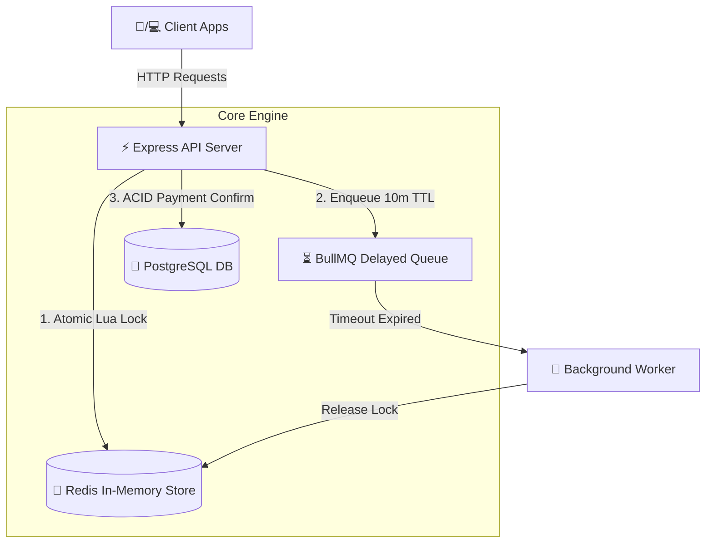
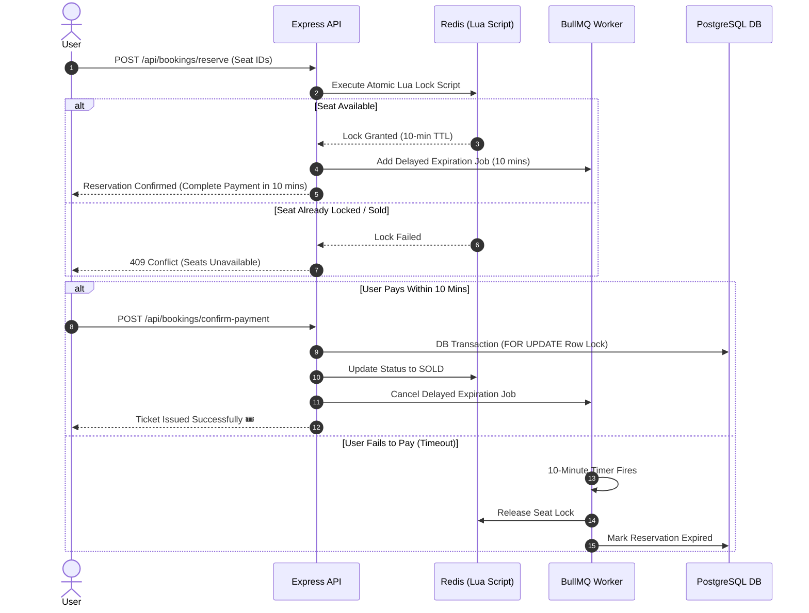

# 🎟️ High-Performance Ticket Booking Backend Service

[](https://nodejs.org/)
[](https://www.typescriptlang.org/)
[](https://www.postgresql.org/)
[](https://redis.io/)
[](https://docs.bullmq.io/)
[](https://jestjs.io/)

A production-grade, highly scalable backend engine designed to handle high-concurrency ticket reservations (similar to BookMyShow or Ticketmaster). Built with atomic seat-locking mechanisms to completely eliminate race conditions and double-booking issues under heavy load.

---

## 📐 Architecture & System Flow

### 1. High-Level System Architecture



---

### 2. Seat Reservation & Expiration Lifecycle



---

## 🔥 Key Technical Features

- 🔒 **Zero Double-Booking Engine**: Atomic Redis Lua scripts executing sub-millisecond in-memory seat locks to prevent race conditions.
- ⏱️ **Automatic Delayed Expirations**: Integrated **BullMQ** background workers backed by Redis Streams managing 10-minute dynamic TTL timers.
- 🛡️ **ACID Compliance & Row-Level Locking**: PostgreSQL connection pooling paired with `FOR UPDATE` row locks during final payment confirmation.
- ⚡ **High Concurrency Ready**: Non-blocking asynchronous event loop handling high throughput during flash-sale scenarios.
- 🧪 **Unit Test Suite**: 100% passing Jest testing suite covering atomic concurrency state handlers and Redis Lua scripts.

---

## 🛠️ Tech Stack & Infrastructure

| Technology | Purpose |
| :--- | :--- |
| **React + Vite** | Lightning-fast frontend framework and build tool for interactive user interfaces |
| **Tailwind CSS** | Utility-first CSS framework for rapid, responsive UI styling and animations |
| **TypeScript** | End-to-end type-safe code architecture across both client and server |
| **Node.js + Express** | High-performance asynchronous API runtime |
| **Redis 7** | Sub-millisecond seat locking via Lua Scripts |
| **PostgreSQL 15** | Relational storage & ACID compliant transactional processing |
| **BullMQ** | Reliable asynchronous job queue for handling dynamic TTL expirations |
| **Docker Compose** | Single-command containerized infrastructure deployment |
| **Jest** | Automated backend unit testing framework |

---

## 📁 Repository Structure

```text
├── docker-compose.yml       # Docker configuration for Postgres & Redis
├── package.json             # Root orchestration scripts (dev/build/test)
├── README.md                # Project documentation
├── backend/                 # Backend service (Express + Redis + PostgreSQL)
│   ├── src/
│   │   ├── config/          # Database and Redis configurations
│   │   ├── controllers/     # Route controllers (booking, show)
│   │   ├── db/              # Database migrations and schemas
│   │   ├── queues/          # BullMQ queue processors
│   │   ├── services/        # Business logic and lock services
│   │   ├── __tests__/       # Backend tests
│   │   └── index.ts         # Backend entry point
│   ├── package.json
│   ├── tsconfig.json
│   └── jest.config.cjs      # Testing configuration
└── frontend/                # Frontend app (React + Vite)
    ├── public/              # Public assets (favicon, icons)
    ├── src/
    │   ├── app/             # Application root (App.tsx)
    │   ├── assets/          # Static assets (hero image, svgs)
    │   ├── features/        # Feature-based modules (booking api, components, types)
    │   ├── shared/          # Shared UI components (Header, NotificationToast)
    │   ├── styles/          # Global stylesheets
    │   └── main.tsx         # React entry point
    ├── index.html
    ├── package.json
    ├── tsconfig.json        # TypeScript configuration
    └── vite.config.ts       # Vite bundler configuration
```

---

## 🚀 Getting Started

### Prerequisites

- [Node.js](https://nodejs.org/) (v18 or higher)
- [Docker Desktop](https://www.docker.com/products/docker-desktop/)

---

### 1. Clone the Repository

```bash
git clone https://github.com/your-username/your-repo-name.git
cd your-repo-name
```

### 2. Install Dependencies

```bash
npm install
cd backend && npm install && cd ..
cd frontend && npm install && cd ..
```

### 3. Start Infrastructure (PostgreSQL + Redis)

Launch the required services using Docker Compose:

```bash
docker-compose up -d
```

### 4. Setup Database Migrations

Run backend database migrations and seed initial data:

```bash
cd backend
npm run build
npm run migrate
cd ..
```

### 5. Run the Application

#### Development Mode:
```bash
npm run dev
```

#### One command (infra + migrate + run both apps):
```bash
npm run dev:all
```

#### Production Build:
```bash
npm run build
npm run start --prefix backend
```

---

## 🧪 Running Tests

To run the automated Jest test suite validating Redis Lua locking and concurrency logic:

```bash
npm test
```

---


## 📝 License

This project is licensed under the [MIT License](LICENSE).

